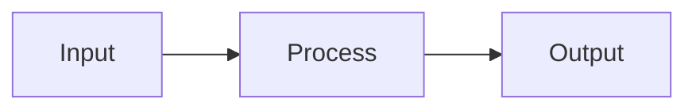

# Slide System Guide

The `/slides` command references this guide for creating reveal.js-compatible extended Markdown and HTML slides.

---

## 1. Extended Markdown Syntax for Slides

The `/slides` command outputs this format and converts it to reveal.js HTML.

### Slide Boundaries

```
---
```

A line containing only `---` marks the boundary between slides.

### Slide Type Directives

```html
<!-- .slide: class="title-slide" -->
<!-- .slide: class="section-slide" -->
```

- `title-slide`: Title page (navy background, gold accent)
- `section-slide`: Section divider (navy background, orange label)
- No directive: Default content slide (white background, header bar)

### Mermaid Diagrams

````markdown

````

Supported Mermaid types: `flowchart`, `sequenceDiagram`, `timeline`, `mindmap`, `pie`, `gantt`.

### HTML+CSS Diagrams

For complex visuals that Mermaid cannot express, use HTML with CSS classes from the theme:

```html
<div class="layer-stack">
  <div class="layer" style="background: var(--accent-orange)">Layer Name</div>
  <div class="layer" style="background: var(--accent-green)">Another Layer</div>
</div>
```

### Callout Boxes

```html
<div class="callout">Key message here</div>
<div class="callout-red">Warning or critical point</div>
```

### Charts (Chart.js)

```html
<canvas id="chart1" width="600" height="400"></canvas>
<script>
new Chart(document.getElementById('chart1'), {
  type: 'bar',
  data: { labels: ['A','B','C'], datasets: [{ data: [10,20,30] }] }
});
</script>
```

### Tables

Use Markdown tables for simple data, HTML `<table>` for styled/complex tables.

```markdown
| Item | Value |
|------|-------|
| A    | 100   |
```

### Speaker Notes

```
Note: Speaker notes go here. Not visible in the presentation.
```

### Two-Column Layout

```html
<div class="two-column">
  <div>Left content</div>
  <div>Right content</div>
</div>
```

### Stats Row (Metric Cards)

```html
<div class="stats-row">
  <div class="stat-card">
    <div class="stat-number">42%</div>
    <div class="stat-label">Improvement</div>
  </div>
  <div class="stat-card">
    <div class="stat-number">3.2x</div>
    <div class="stat-label">Speedup</div>
  </div>
</div>
```

---

## 2. Diagram Type Guide

| Diagram Type | Implementation | When to Use |
|-------------|---------------|-------------|
| Flowchart / workflow | Mermaid `flowchart` | Processes, data flow, simple architecture |
| Timeline | Mermaid `timeline` | Project milestones, schedules |
| Mind map | Mermaid `mindmap` | Category breakdown, overview |
| Sequence diagram | Mermaid `sequenceDiagram` | API calls, component communication |
| Layer stack | HTML+CSS `.layer-stack` | SW/HW layer hierarchy |
| Server/node architecture | HTML+CSS `.node-grid` | Distributed systems, cluster topology |
| Comparison table | HTML `<table>` with styled header | Spec comparison, performance comparison |
| Line/bar chart | Chart.js `<canvas>` + `<script>` | Performance data, trends |
| Pie chart | Mermaid `pie` or Chart.js | Ratios, distributions |
| Icon+label grid | HTML+CSS `.icon-grid` | Tech stacks, service lists |
| Highlight callout | `<div class="callout">` | Key messages, summaries |
| Before/After comparison | HTML+CSS `.comparison` | Improvement effects, A vs B |

### Diagram Density Limits

Mermaid and arch-diagram nodes shrink to fit the slide. Too many nodes makes text unreadable.

| Diagram Type | Max Nodes Per Slide |
|-------------|-------------------|
| Mermaid `flowchart LR` (horizontal) | **8 nodes** (including subgraph labels) |
| Mermaid `flowchart TB` (vertical) | **10 nodes** |
| `.arch-diagram` single row | **5-6 boxes** |
| `.arch-diagram` total | **15 boxes** |

**When exceeded:**
1. Split into 2 slides (half each)
2. Switch layout: Mermaid LR → `.arch-diagram` (supports multi-row) or `.layer-stack`
3. Group with `.arch-group` to create visual hierarchy

**Never** put 10+ nodes in a single Mermaid `flowchart LR` — reveal.js `max-height: 360px` constraint will shrink nodes below readable size.

---

## 3. CSS Class Catalog

These classes are provided by the theme CSS. The `/slides` command uses them when generating HTML blocks.

### Layout Classes

| Class | Description |
|-------|------------|
| `.layer-stack` | Vertical stack of colored layers (each child `.layer` is a row) |
| `.node-grid` | Grid layout for server/node cards |
| `.icon-grid` | Flexbox grid with rounded-corner icon cards |
| `.two-column` | Two-column side-by-side layout |
| `.comparison` | Left-right comparison (before/after) with colored headers |
| `.stats-row` | Horizontal row of metric cards (`.stat-card` > `.stat-number` + `.stat-label`) |
| `.timeline-custom` | CSS-based timeline (alternative to Mermaid timeline) |
| `.arch-diagram` | Architecture diagram container (rows of boxes with connectors) |
| `.arch-diagram.arch-mini` | Compact version of arch-diagram for side-by-side layouts |
| `.arch-group` | Dashed-border group box with `.arch-group-label` |
| `.arch-arrow-down` | Container for SVG down-arrow between rows |
| `.arch-arrow-right` | Container for SVG right-arrow between boxes |
| `.arch-arrow-bidir` | Container for SVG bidirectional arrow |
| `.arch-connector-label` | Small text label on a connector |

### Visual Accent Classes

| Class | Description |
|-------|------------|
| `.callout` | Gold (#E8A020) highlight box with rounded corners, bold black text |
| `.callout-red` | Red highlight box for warnings/critical points |
| `.arch-highlight` | Orange highlight for changed/key components in arch-diagram |
| `.arch-new` | Green highlight for newly added components in arch-diagram |
| `.arch-muted` | Gray muted style for unchanged components in arch-diagram |
| `.callout-subtle` | Light background callout with orange left border (less emphasis) |
| `.fa-icon-orange/green/blue/red/muted` | Font Awesome icon color utilities |
| `.fa-icon-lg/xl/2xl` | Font Awesome icon size utilities |

### Slide Type Classes (used via `<!-- .slide: class="..." -->`)

| Class | Description |
|-------|------------|
| `.title-slide` | Navy background, gold curve decoration, large orange title |
| `.section-slide` | Navy background, orange "Table of Contents" label, white section title |
| (default) | White background, dark charcoal header bar with white title + logo |

---

## 4. Slide Content Guidelines

When creating extended Markdown for slides:

1. **Every slide should have at least one visual element**: diagram, table, chart, callout, or stats row.
2. **Title slide** must include: presentation title, subtitle, presenter name, date.
3. **Section slides** are expensive (1 slide, zero information). Only use when the section has **3+ content slides** after it. For sections with 1-2 content slides, skip the section slide and use h2 heading on the content slide instead.
4. **Content slides** should have concise bullet points (max 5-6 per slide) plus a visual.
5. **Data with numbers** should use Chart.js or tables, not just text.
6. **Processes and flows** should use Mermaid diagrams, not bullet lists.
7. **Hierarchies and stacks** should use `.layer-stack` or `.node-grid` HTML.
8. **Key takeaways** should use `.callout` boxes.
9. **Comparisons** should use `.comparison` layout or side-by-side tables.
10. **Metrics** should use `.stats-row` with large numbers.
11. **Every slide must fill ≥60% of the canvas** with meaningful content. If a slide is sparse (stats-row + short text only), merge it into an adjacent slide.
12. **`two-column` layout requires balanced columns**: both sides must have comparable visual weight. If one side is a chart and the other is just a stat-card or 2 lines of text, either add content to the light side or use single-column layout.
13. **Section slide budget**: total section slides ≤ 20% of all slides. If a 20-slide deck has more than 4 section slides, consolidate.

---

## 5. Architecture-Anchored Slide Pattern

시스템/인프라 변경사항을 설명할 때, 개별 기능을 독립적으로 나열하지 않고 **전체 아키텍처 다이어그램을 앵커로 사용**하여 변경 지점을 하이라이트하는 패턴.

### 패턴 구조

```
[섹션 슬라이드] "1. 시스템 아키텍처 개선"

[아키텍처 개요 슬라이드] — 전체 시스템 다이어그램 (모든 컴포넌트 표시)
  → 이번에 변경된 부분을 색상/테두리로 하이라이트
  → 변경되지 않은 부분은 회색(muted)으로 표시

[변경점 A 슬라이드] — 동일 아키텍처 다이어그램에서 A 부분만 확대/강조
  → 좌: 아키텍처에서 A의 위치 (하이라이트)
  → 우: A의 before/after 상세

[변경점 B 슬라이드] — 동일 아키텍처에서 B 부분만 확대/강조
  → 같은 패턴 반복
```

### 구현 방법

#### 아키텍처 개요 슬라이드

HTML+CSS `.arch-diagram` 클래스를 사용하여 전체 시스템 다이어그램을 그린다. 변경된 컴포넌트는 강조 색상, 나머지는 muted.

```html
<div class="arch-diagram">
  <div class="arch-row">
    <div class="arch-box arch-highlight">변경된 컴포넌트 A</div>
    <div class="arch-box arch-muted">변경 없는 컴포넌트</div>
    <div class="arch-box arch-highlight">변경된 컴포넌트 B</div>
  </div>
  <div class="arch-connector">↕</div>
  <div class="arch-row">
    <div class="arch-box arch-muted">하위 레이어</div>
  </div>
</div>
```

#### 변경점 상세 슬라이드

`two-column` 레이아웃으로 좌측에 아키텍처 위치, 우측에 before/after:

```html
<div class="two-column">
  <div>
    <!-- 축소된 아키텍처 다이어그램, 해당 부분만 하이라이트 -->
    <div class="arch-diagram arch-mini">...</div>
  </div>
  <div>
    <!-- before/after 상세 -->
    <div class="comparison">
      <div class="compare-before">...</div>
      <div class="compare-after">...</div>
    </div>
  </div>
</div>
```

### 언제 사용하는가

| 조건 | Architecture-Anchored 사용 |
|------|--------------------------|
| 시스템/인프라의 여러 컴포넌트를 변경 | **사용** — 전체 그림에서 위치를 보여줘야 함 |
| 단일 기능 추가/수정 | 불필요 — 일반 comparison으로 충분 |
| 데이터 흐름/경로가 변경 | **사용** — 경로 전체를 보여주고 변경 구간을 하이라이트 |
| 성능 수치 보고 | 불필요 — stats-row나 chart로 충분 |

---

## 6. Font Awesome Icons

The theme includes Font Awesome 6 via CDN. Use professional icons instead of emoji for a polished look.

### Usage in HTML

```html
<!-- In icon-grid -->
<div class="icon-item">
  <i class="fas fa-server fa-icon-orange"></i>
  <div class="icon-label">Server</div>
</div>

<!-- Inline in text -->
<i class="fas fa-check-circle fa-icon-green"></i> Completed

<!-- In compare headers -->
<div class="compare-header"><i class="fas fa-times-circle"></i> Before</div>
<div class="compare-header"><i class="fas fa-check-circle"></i> After</div>
```

### Icon Mapping by Domain

| Domain | Icon | FA Class |
|--------|------|----------|
| Server/Node | server rack | `fas fa-server` |
| GPU/Compute | microchip | `fas fa-microchip` |
| Network | network | `fas fa-network-wired` |
| Database/Storage | database | `fas fa-database` |
| Performance/Speed | gauge | `fas fa-gauge-high` |
| Code/Development | code | `fas fa-code` |
| Config/Settings | gear | `fas fa-gear` |
| Bug/Fix | bug | `fas fa-bug` |
| Chart/Data | chart | `fas fa-chart-line` |
| Security | shield | `fas fa-shield-halved` |
| Cloud | cloud | `fas fa-cloud` |
| Container/Docker | cube | `fas fa-cube` |
| API/Integration | plug | `fas fa-plug` |
| File/Document | file | `fas fa-file-code` |
| User/Team | users | `fas fa-users` |
| Rocket/Launch | rocket | `fas fa-rocket` |
| Warning | triangle | `fas fa-triangle-exclamation` |
| Success | circle check | `fas fa-circle-check` |
| Arrow right | arrow | `fas fa-arrow-right` |
| Refresh/Sync | rotate | `fas fa-rotate` |

### Color Utility Classes

| Class | Color |
|-------|-------|
| `fa-icon-orange` | MangoBoost orange (#E8A020) |
| `fa-icon-green` | Green (#4CAF50) |
| `fa-icon-blue` | Blue (#2196F3) |
| `fa-icon-red` | Red (#E53935) |
| `fa-icon-muted` | Gray (#5a6270) |

### Size Utility Classes

| Class | Size |
|-------|------|
| `fa-icon-lg` | 1.4em |
| `fa-icon-xl` | 2em |
| `fa-icon-2xl` | 2.5em |

---

## 7. Architecture Diagram — Connectors & Groups

The basic `.arch-diagram` supports boxes in rows. For professional diagrams, use these enhanced features:

### SVG Arrow Connectors

Use inline SVG for precise arrows between rows/boxes:

```html
<div class="arch-diagram">
  <div class="arch-row">
    <div class="arch-box arch-highlight">Component A</div>
    <div class="arch-box arch-muted">Component B</div>
  </div>
  <!-- Down arrow with label -->
  <div class="arch-arrow-down">
    <svg width="24" height="28" viewBox="0 0 24 28">
      <line x1="12" y1="0" x2="12" y2="20" stroke="#E8A020" stroke-width="2.5"/>
      <polygon points="6,18 12,28 18,18" fill="#E8A020"/>
    </svg>
  </div>
  <div class="arch-connector-label">KV Transfer</div>
  <div class="arch-row">
    <div class="arch-box arch-new">New Component</div>
  </div>
</div>
```

### Bidirectional Arrow

```html
<div class="arch-arrow-bidir">
  <svg width="24" height="32" viewBox="0 0 24 32">
    <polygon points="6,8 12,0 18,8" fill="#E8A020"/>
    <line x1="12" y1="6" x2="12" y2="26" stroke="#E8A020" stroke-width="2.5"/>
    <polygon points="6,24 12,32 18,24" fill="#E8A020"/>
  </svg>
</div>
```

### Horizontal Arrow (between boxes in same row)

Place between two `.arch-box` elements inside `.arch-row`:

```html
<div class="arch-row">
  <div class="arch-box arch-highlight">Source</div>
  <div class="arch-arrow-right">
    <svg width="36" height="16" viewBox="0 0 36 16">
      <line x1="0" y1="8" x2="28" y2="8" stroke="#E8A020" stroke-width="2.5"/>
      <polygon points="26,3 36,8 26,13" fill="#E8A020"/>
    </svg>
  </div>
  <div class="arch-box arch-new">Destination</div>
</div>
```

### Group Box (visual grouping)

Wrap related boxes in a dashed border with a label:

```html
<div class="arch-group">
  <div class="arch-group-label">Network Layer</div>
  <div class="arch-row">
    <div class="arch-box arch-highlight">NIC A</div>
    <div class="arch-box arch-highlight">NIC B</div>
  </div>
</div>
```

---

## 8. Visual Design Principles

Rules for creating professional, PPT-quality slides.

### Slide Composition

1. **One message per slide**: Each slide conveys exactly one idea. If you need two ideas, use two slides.
2. **Visual hierarchy**: Title (largest) → Key visual/diagram (center, dominant) → Supporting text (smaller, below or side). The eye should flow from top-left to the visual, then to text.
3. **Whitespace is design**: At least 25% of slide area should be empty. Crowded slides look amateur. When in doubt, remove text and add another slide.
4. **Consistent visual density**: All content slides should feel similar in "weight". Avoid one slide with 10 bullets next to one with a single diagram.

### Color Usage

1. **Max 2 accent colors per slide**: Orange (primary) + one secondary (green, blue, or red). More than 2 creates visual noise.
2. **Muted for context, color for focus**: Use `.arch-muted` gray for background elements, color only for what matters.
3. **Color = meaning**: Orange = key/changed, Green = new/good, Red = problem/before, Blue = info/neutral. Be consistent.

### Typography

1. **3 sizes max per slide**: Heading, body, and caption. Never 4+ different font sizes.
2. **Bold sparingly**: Only for the most important 2-3 words per slide. If everything is bold, nothing is.

### Diagrams

1. **Diagrams should be self-explanatory**: If the diagram needs a paragraph of text to explain it, the diagram is wrong.
2. **Use arrows and labels**: Boxes without connections are just a list in boxes. Always show relationships.
3. **Align everything**: All boxes in a row should be same height. All arrows should be straight. Misalignment looks careless.

### Terminology Clarity

1. **No undefined terms**: Every domain-specific or potentially ambiguous word must be defined at first appearance. If the audience cannot understand a term from the slide alone (without hearing the presenter), it needs a definition.
2. **Define overloaded words**: Generic words used as specific concepts (Phase, Step, Layer, Level, Module, Pipeline) must be explicitly scoped. E.g., "Run Pipeline (7-step automated code inside `runner.py`)" — not just "7 Phases".
3. **One word per concept**: Do not alternate between synonyms for the same thing. Pick one term and use it consistently across all slides.
4. **Dedicated glossary slide when needed**: If 5+ terms need defining, add a "Terms / Definitions" slide (callout or table) after the agenda or at the start of the relevant section.
5. **Expand abbreviations on first use**: E.g., "MFU (Model FLOPs Utilization)", "TPOT (Time Per Output Token)".
6. **"N items" claims must enumerate**: If a slide says "4 convergence conditions" or "7 steps", the N items must be listed — on the same slide (briefly) or with a reference to another slide that lists them. A number without its contents is an empty claim.

---

## 9. Theme Directory Structure

Themes are stored at `~/.claude/templates/<theme-name>/`:

```
~/.claude/templates/<theme-name>/
├── theme.css    # reveal.js custom CSS (all visual styling)
├── base.html    # HTML skeleton with {{TITLE}}, {{THEME_CSS}}, {{SLIDES_CONTENT}} placeholders
└── logo.svg     # Logo asset (optional, can be inline in CSS)
```

Additional shared resources:

```
~/.claude/templates/
├── assets/
│   └── tech-logos.json    # Technology logo CDN URL catalog
└── snippets/
    ├── server-topology.html       # Dual-server internal architecture
    ├── pipeline-3col.html         # Three-stage pipeline flow
    ├── deployment-topology.html   # Controller → compute nodes
    ├── layer-stack-l0-l9.html     # L0-L9 layer stack
    ├── benchmark-chart-2axis.html # Chart.js with datalabels + annotation
    ├── llm-model-graph.html       # Neural network architecture (Llama-style)
    ├── timeline-horizontal.html   # Horizontal project timeline
    └── prohibition-pattern.html   # "This doesn't work" pattern
```

The `/slides` command reads theme files, assembles a single self-contained HTML file, and references snippets and assets when generating extended Markdown.

---

## 10. Extended CSS Class Catalog (v2)

In addition to the classes in §3, the theme provides these reusable components:

### Layout Components

| Class | Description | Usage |
|-------|-----------|-------|
| `.three-column` | Equal 3-column grid | `<div class="three-column">` with 3 children |
| `.three-column.narrow-wide-narrow` | 1:2:1 ratio 3-column | Pipeline source → process → deploy |
| `.pipeline-flow` | Horizontal multi-stage pipeline | Wrap `.pipeline-stage` + `.pipeline-arrow` |
| `.pipeline-stage` | Single pipeline stage | `.pipeline-stage-header` + `.pipeline-stage-body` |
| `.pipeline-arrow` | Arrow between pipeline stages | Contains `→` text or SVG |

### Infrastructure Components

| Class | Description | Usage |
|-------|-----------|-------|
| `.server-rack` | Server internal structure container | Wrap `.server-rack-title` + `.server-rack-grid` |
| `.server-component` | Individual HW component inside server | Modifiers: `.gpu`, `.cpu`, `.nic`, `.hbm`, `.dpu` |
| `.server-fabric` | Network fabric bar inside server | Intra/Inter Net Fabric label |
| `.network-topology` | Topology container with overlay support | Wrap nodes + SVG overlay |
| `.network-nodes` | Flex row of network node boxes | Contains `.network-node` children |
| `.network-node` | Single node in topology | `.network-node-label` + content |
| `.network-fabric-bar` | Horizontal network fabric bar | Between controller and nodes |

### Accent Components

| Class | Description | Usage |
|-------|-----------|-------|
| `.prohibition-overlay` | Red circle + slash prohibition symbol | Wrap content that should appear "prohibited" |
| `.logo-row` | Horizontal flex row for tech badges | Contains `.logo-badge` children |
| `.logo-badge` | Rounded badge with tech name (+ optional logo img) | `<span class="logo-badge">vLLM</span>` |
| `.logo-badge.accent` | Gold-highlighted badge variant | For primary/featured tech |
| `.milestone-card` | Small card below timeline point | Icon + 1-line label |
| `.person-thought` | Person icon + thought bubble composition | `.person-thought-icon` + `.person-thought-bubble` |

### Container/Docker Components

| Class | Description | Usage |
|-------|-----------|-------|
| `.container-row` | Vertical list of container items | Contains `.container-item` children |
| `.container-item` | Single container with icon + label | `.container-icon` + `.container-label` |
| `.container-icon` | Colored icon box | Modifiers: `.benchmark`, `.monitoring`, `.database`, `.dashboard` |

---

## 11. Minimum Font-Size Rules

**All text must be readable at presentation distance (3+ meters).** These minimums are enforced:

| Element | Min Size | Notes |
|---------|----------|-------|
| Body text | 16px (0.72em) | |
| `.arch-box`, `.layer` text | 14px (0.64em) | |
| `.logo-badge` | 13px (0.6em) | |
| `.stat-number` | 28px (1.3em) | |
| Table cells | 14px (0.64em) | |
| SVG `<text>` | `font-size="10"` | No SVG text below 10px |
| Title slide h1 | 36px (1.8em) | `max-width: 75%` to prevent overlap |
| Callout body | 16px (0.72em) | |

When content would require font smaller than minimum, **reduce the content** (fewer words, abbreviate) rather than shrinking the font.

---

## 12. Semantic Color Coding

입력 텍스트에서 **의미적 구분**이 감지되면, 동일한 회색/기본 스타일로 통일하지 않고 의미별로 색상을 차별화한다.

### 감지 → 색상 매핑

| 입력에서 감지되는 패턴 | 색상 처리 |
|----------------------|----------|
| 자사 vs 표준/외부 (예: "Mango" vs "Linux") | 자사=`var(--gold)`, 외부=`#bbb` (gray) |
| 정상 vs 에러/위험 (예: "성공" vs "Kernel panic") | 정상=`var(--green)`, 에러=`var(--red)` |
| Input → Process → Output 플로우 | Input=`var(--charcoal)`, Process=white/border, Output=`var(--gold)` |
| 단계별 진행 (1→2→3→…) | 단계마다 다른 색상 그라데이션 (green→blue→gold→orange→red 등) |
| 새로운 것 vs 기존 것 | 새로운=`var(--green)` or `var(--gold)`, 기존=`var(--bg-light)` gray |
| Before vs After | Before=`var(--red-soft)`, After=`var(--green-soft)` |

### 적용 원칙

1. **색상 힌트가 입력에 있으면 반드시 반영**: "노란색", "회색", "초록색" 등 명시적 색상 기술은 그대로 적용
2. **암묵적 의미 구분도 반영**: "자사 컴포넌트" vs "Linux 표준 스택"처럼 역할이 다른 요소는 색상으로 구분
3. **같은 역할 = 같은 색상**: 전체 슬라이드에서 동일 역할의 요소는 동일한 색상을 유지
4. **범례 필수**: 2색 이상 사용 시 범례 또는 라벨로 색상 의미를 명시

---

## 12-1. 아키텍처 다이어그램 정렬 규칙

계층형 아키텍처를 arch-diagram이나 inline HTML로 그릴 때, **모든 행의 열 너비가 반드시 일치**해야 한다.

### 문제

각 행을 독립적인 flex row로 만들면, 행마다 label 칼럼과 content 칼럼의 너비가 달라져 세로 정렬이 맞지 않는다.

### 해결: CSS Grid 또는 고정 너비

**방법 1: CSS Grid (권장)**
```html
<div style="display:grid; grid-template-columns:80px 1fr 1fr; gap:3px;">
  <!-- Row 1 -->
  <div>Comm. library</div>
  <div style="background:var(--gold);">Mango Lib</div>
  <div style="background:#bbb;">Linux Lib</div>
  <!-- Row 2 — 같은 grid → 열 너비 자동 정렬 -->
  <div>Kernel</div>
  <div style="background:var(--gold);">Mango Driver</div>
  <div style="background:#bbb;">Linux Kernel</div>
</div>
```

**방법 2: arch-diagram + arch-box에 고정 min-width**
```html
<div class="arch-diagram">
  <div class="arch-row">
    <div class="arch-box" style="min-width:80px;">Label</div>
    <div class="arch-box arch-highlight" style="min-width:180px;">Mango</div>
    <div class="arch-box arch-muted" style="min-width:180px;">Linux</div>
  </div>
</div>
```
모든 행에서 **동일한 min-width 값**을 사용해야 열이 정렬된다.

### 체크리스트

- [ ] 모든 행의 label 칼럼이 동일한 너비
- [ ] 모든 행의 content 칼럼이 동일한 너비 (또는 같은 flex/grid 비율)
- [ ] Comm. library 행의 4셀과 Kernel 행의 2셀처럼 열 수가 다른 경우, `grid-column: span N` 또는 내부 flex로 처리하되 외부 grid 열 너비는 유지

---

## 13. Mermaid vs HTML+CSS+SVG 선택 기준 (Escalation Rules)

Mermaid는 빠르고 간결하지만, **노드별 색상 차별화가 불가능**하다. 아래 조건에 해당하면 Mermaid 대신 HTML+CSS (또는 inline SVG)를 사용한다.

### Mermaid 사용 (기본)

| 조건 | 이유 |
|------|------|
| 모든 노드가 같은 역할/색상 | Mermaid 기본 스타일로 충분 |
| labeled arrows, branching, merging | Mermaid의 강점 |
| 빠른 프로토타이핑 | 코드가 짧고 수정이 쉬움 |

### HTML+CSS+SVG로 전환 (escalate)

| 조건 | 이유 |
|------|------|
| **노드별 색상 차별화** 필요 (Input=dark, Output=gold, Error=red 등) | Mermaid는 노드 개별 스타일링이 제한적 |
| **순환 사이클** (3~4개 노드가 원형으로 연결, 자기 참조 루프 포함) | Mermaid cycle은 시각적으로 빈약 → inline SVG curved arrows |
| **의미별 아이콘** 필요 (Font Awesome 아이콘을 노드 안에 넣어야 할 때) | Mermaid 노드 안에 아이콘 불가 |
| **계층+색상 동시 필요** (스택의 각 레이어가 다른 색상) | `.layer-stack` with inline `background:` |

### 패턴별 구현

#### 순환 사이클 (3~4 노드)

"A→B→C→A" 순환 구조가 입력에 있으면 **inline SVG**로 구현한다:
- `<rect>` + `<text>`: charcoal rounded boxes (rx=12)
- `<path>` + curved arrows: 노드 사이 곡선 연결
- Self-loop arrows: 각 노드에 자기 참조 화살표 (피드백 루프 표현)

**Inline SVG 좌표 안전 규칙 (필수 — 모든 방향):**

모든 SVG 요소의 **모든 좌표**(x, y, cx, cy, path 데이터, polygon points 등)는 **viewBox 범위 안에** 있어야 한다. `overflow:hidden`이 적용되므로 viewBox 밖의 요소는 **잘린다**.

이 규칙은 y축뿐 아니라 **x축, 4방향 모두**에 적용된다. 가장 흔한 위반: self-loop 곡선의 제어점, self-loop 옆 텍스트 라벨.

#### 핵심 공식

`viewBox="0 0 W H"`일 때, SVG 안의 **모든 숫자**(좌표, 제어점, text x/y, polygon points)가 아래 범위를 만족해야 한다:

```
모든 x 좌표: 0 ≤ x ≤ W
모든 y 좌표: 0 ≤ y ≤ H
```

안전 마진을 포함하면:

```
안전 영역: (20, 20) ~ (W-20, H-20)
```

#### 검증 대상 요소 (모두 확인)

| SVG 요소 | 확인할 좌표 |
|----------|-----------|
| `<rect>` | `x`, `y`, `x+width`, `y+height` |
| `<text>` | `x`, `y` (text-anchor에 따라 텍스트가 x 기준 왼쪽/오른쪽으로 확장) |
| `<line>` | `x1`, `y1`, `x2`, `y2` |
| `<path d="M ... C ...">` | **M 좌표 + 모든 C/S/Q 제어점 + 끝점** (제어점이 가장 위험) |
| `<polygon points="...">` | 모든 point 쌍 |
| `<circle>` | `cx-r`, `cy-r`, `cx+r`, `cy+r` |

#### Self-loop 방향별 규칙

| self-loop 위치 | 주의 방향 | 규칙 |
|---------------|----------|------|
| 노드 **위** (상단 arc) | y축 음수 | 노드 y ≥ 40, 제어점 y ≥ 10 |
| 노드 **오른쪽** (우측 arc) | x축 초과 | 노드 right edge + arc 반경 ≤ W-10 |
| 노드 **왼쪽** (좌측 arc) | x축 음수 | 노드 left edge - arc 반경 ≥ 10 |
| 노드 **아래** (하단 arc) | y축 초과 | 노드 bottom edge + arc 반경 ≤ H-10 |

#### `<text>` 라벨 좌표 규칙

텍스트 라벨은 self-loop나 노드 옆에 배치할 때 viewBox를 벗어나기 쉽다:

| text-anchor | x 좌표 범위 | 설명 |
|-------------|-----------|------|
| `"start"` (default) | `0 ≤ x`, 텍스트가 **오른쪽**으로 확장 | x + 글자폭 ≤ W |
| `"middle"` | 텍스트가 x 기준 **양쪽**으로 확장 | x ± 글자폭/2 이 0~W 안에 |
| `"end"` | 텍스트가 **왼쪽**으로 확장 | `0 ≤ x ≤ W` |

**`y` 좌표**: font-size 높이만큼 위로 확장하므로, `y ≥ font-size` 이어야 잘리지 않음.

#### 잘못된 예 모음

```xml
<!-- viewBox="0 0 440 320" -->

<!-- ❌ 위쪽 self-loop: y=-20 → 위로 잘림 -->
<path d="M 150 15 C 130 -20, 310 -20, 290 15" .../>

<!-- ❌ 오른쪽 self-loop: x=460 > W(440) → 오른쪽 잘림 -->
<path d="M 425 205 C 460 180, 460 260, 425 245" .../>

<!-- ❌ 왼쪽 self-loop: x=-20 → 왼쪽 잘림 -->
<path d="M 15 205 C -20 180, -20 260, 15 245" .../>

<!-- ❌ 텍스트 라벨: y=-4, x=470, x=-10 → 잘림 -->
<text x="220" y="-4" ...>라벨</text>
<text x="470" y="225" ...>라벨</text>
<text x="-10" y="225" ...>라벨</text>
```

#### 올바른 예 (viewBox 안에서 모든 요소 배치)

```xml
<!-- viewBox="0 0 500 380" — 여유 있게 잡고 모든 요소를 안에 배치 -->

<!-- ✅ 위쪽 self-loop: 노드 y=50, 제어점 y=20 -->
<rect x="150" y="50" width="200" height="56" rx="12" .../>
<path d="M 195 50 C 190 20, 310 20, 305 50" .../>
<text x="250" y="15" text-anchor="middle" font-size="10" ...>패치 개선 루프</text>

<!-- ✅ 오른쪽 self-loop: 노드 right=430, 제어점 x=470 → viewBox W=500 안에 -->
<rect x="270" y="240" width="160" height="50" rx="12" .../>
<path d="M 425 245 C 460 220, 460 275, 425 285" .../>
<text x="470" y="255" text-anchor="start" font-size="10" ...>테스트 개선</text>

<!-- ✅ 왼쪽 self-loop: 노드 left=50, 제어점 x=20 → viewBox x=0 안에 -->
<rect x="50" y="240" width="160" height="50" rx="12" .../>
<path d="M 55 245 C 20 220, 20 275, 55 285" .../>
<text x="15" y="255" text-anchor="end" font-size="10" ...>탐지 정밀화</text>
```

#### 생성 후 필수 검증

SVG를 생성한 후, **모든 숫자를 viewBox와 대조**한다:

1. `viewBox="0 0 W H"` 에서 W, H 확인
2. SVG 내 **모든 숫자**를 스캔:
   - x 계열 (x, x1, x2, cx, path의 홀수번째 숫자): `0 ≤ 값 ≤ W`
   - y 계열 (y, y1, y2, cy, path의 짝수번째 숫자): `0 ≤ 값 ≤ H`
3. 위반 좌표가 하나라도 있으면 → **viewBox 확장** 또는 **요소 위치 조정**
4. viewBox를 확장할 때는 `width`/`height` 속성도 함께 조정

#### 색상 코딩 플로우 (Input → Process → Output)

입력에서 "X 코드 → AI 분석 → Y 결과" 같은 플로우가 있으면:
```html
<div style="display:flex; align-items:center; gap:12px;">
  <!-- Input: charcoal boxes -->
  <div style="background:var(--charcoal); color:#fff; padding:8px 14px; border-radius:8px;">Input A</div>
  <!-- Arrow SVG -->
  <svg width="30" height="20"><line x1="0" y1="10" x2="22" y2="10" stroke="#999" stroke-width="2"/><polygon points="20,5 30,10 20,15" fill="#999"/></svg>
  <!-- Process: white/border bubble -->
  <div style="background:#fff; border:2px solid var(--border-mid); border-radius:14px; padding:10px;">Process</div>
  <!-- Arrow SVG -->
  <svg>...</svg>
  <!-- Output: gold box -->
  <div style="background:var(--gold); color:#000; padding:8px 14px; border-radius:8px;">Output</div>
</div>
```

#### N단계 가로 워크플로우 (N ≤ 6)

입력에서 "N단계 워크플로우/프로세스"가 있으면 **가로 카드 배열**로 구현한다:
- 각 단계를 gradient colored card로 표현 (단계별 다른 색상)
- 단계 사이에 SVG arrow
- 카드 안에: 아이콘 + 제목 + 간략 설명
- 카드 아래에: AI 역할 등 부가 정보

**N > 6이면** 2행으로 분할하거나, 슬라이드를 나눈다.

---

## 14. Chart.js Safe Defaults

Chart.js 차트 생성 시, 아래 기본값을 항상 적용하여 레이블 잘림, 겹침 등 렌더링 문제를 방지한다.

### 필수 기본값

```javascript
options: {
  layout: { padding: { top: 24 } },       // datalabels가 캔버스 밖으로 잘리지 않도록
  plugins: {
    datalabels: {
      clamp: true,                          // 레이블을 캔버스 안에 강제 유지
      // anchor, align, font 등은 차트별 설정
    }
  },
  scales: {
    x: {
      ticks: {
        maxRotation: 0,                     // x축 레이블 회전 방지
        autoSkip: false                     // 레이블 생략 방지 (Before/After 등)
      }
    }
  }
}
```

### Before/After 비교 차트 패턴

Before/After 수치 비교가 있으면, 반드시 **비교 막대그래프**를 포함한다:
- Before = `#ccd0d5` (gray), After = `#E8A020` (gold)
- 배율 배지 (예: "8.9x")를 `chartjs-plugin-annotation`의 `label` type으로 차트 안에 표시
- 배율 배지 스타일: `color: '#E53935'`, red border, white background

```javascript
annotation: {
  annotations: {
    multiplier: {
      type: 'label',
      xValue: 0.5,
      yValue: afterValue * 0.45,  // ← 아래 "배율 배지 위치 계산" 참조
      content: ['8.9x'],
      color: '#E53935',
      font: { size: 16, weight: 'bold' },
      backgroundColor: 'rgba(255,255,255,0.85)',
      borderColor: '#E53935', borderWidth: 1.5, borderRadius: 4,
      padding: { x: 6, y: 3 }
    }
  }
}
```

### 배율 배지 위치 계산 (yValue)

**문제:** `yValue = (before + after) / 2` (산술 평균)를 쓰면, before가 작고 after가 클 때 배지가 작은 막대 꼭대기 근처에 쏠린다. 예: `(5+43)/2 = 24` → 작은 막대(5) 위에 붙어 보임.

**규칙:** `yValue`는 **큰 막대(after) 높이의 40~50%** 위치에 배치한다.

```javascript
// ✅ 올바른 계산
const yValue = afterValue * 0.45;

// ❌ 잘못된 계산 (before/after 차이가 크면 쏠림)
const yValue = (beforeValue + afterValue) / 2;
```

이렇게 하면 배지가 **두 막대 사이의 시각적 중앙**에 위치하여, before 막대 위 + after 막대 중간 정도에 자연스럽게 보인다.

| before | after | 산술 평균 (잘못) | after×0.45 (올바름) |
|--------|-------|-----------------|-------------------|
| 5 | 43 | 24 (너무 낮음) | 19 |
| 10.5 | 93 | 52 (너무 낮음) | 42 |
| 1600 | 21900 | 11750 (너무 낮음) | 9855 |

### Before/After 데이터 감지

입력에서 아래 패턴이 감지되면 **반드시** Before/After 막대그래프를 생성한다:
- "Before X (monthly avg.) | **N** | — " + "After X (1 month) | **M** | **K.Kx** "
- "도입 전 N건 → 도입 후 M건"
- 배율(Nx)이 명시된 전후 비교 수치

---

## 15. Chart.js Script Deferred Execution (필수)

**핵심 문제**: reveal.js HTML에서 Chart.js 초기화 `<script>`가 `<section>` 안에 있으면, Chart.js 라이브러리(`<script src="...chart.js">`)보다 먼저 파싱되어 `Chart is not defined` 에러로 그래프가 렌더링되지 않는다.

### Markdown 작성 규칙

Chart.js 초기화 코드를 Markdown에 작성할 때:
- `Reveal.on('ready', function() { ... });` 래퍼를 **사용하지 않는다**
- 직접 `new Chart(...)` 호출만 작성한다

```html
<script>
  // ✅ 올바른 방식: 래퍼 없이 Chart 초기화만
  new Chart(document.getElementById('chart1'), { ... });
</script>
```

```html
<script>
Reveal.on('ready', function() {
  // ❌ 잘못된 방식: Reveal.on 래퍼 사용 — 변환 시 제거 필요
  new Chart(document.getElementById('chart1'), { ... });
});
</script>
```

### HTML 변환 규칙

변환기(Phase 2)가 슬라이드 내 `<script>` 블록을 만나면:
1. `<script>` → `<script type="text/slide-chart">` 로 변경
2. 이렇게 하면 브라우저가 즉시 실행하지 않음
3. `base.html`의 `Reveal.on('ready', ...)` 핸들러가 모든 `script[type="text/slide-chart"]`를 수집하여 라이브러리 로드 후 실행

### 검증

생성된 HTML에서:
- `<section>` 안에 `<script>`(type 없음)가 있으면 **실패** → `type="text/slide-chart"` 추가
- `<canvas id="X">`가 있지만 `getElementById('X')`가 없으면 **실패** → 초기화 코드 추가
